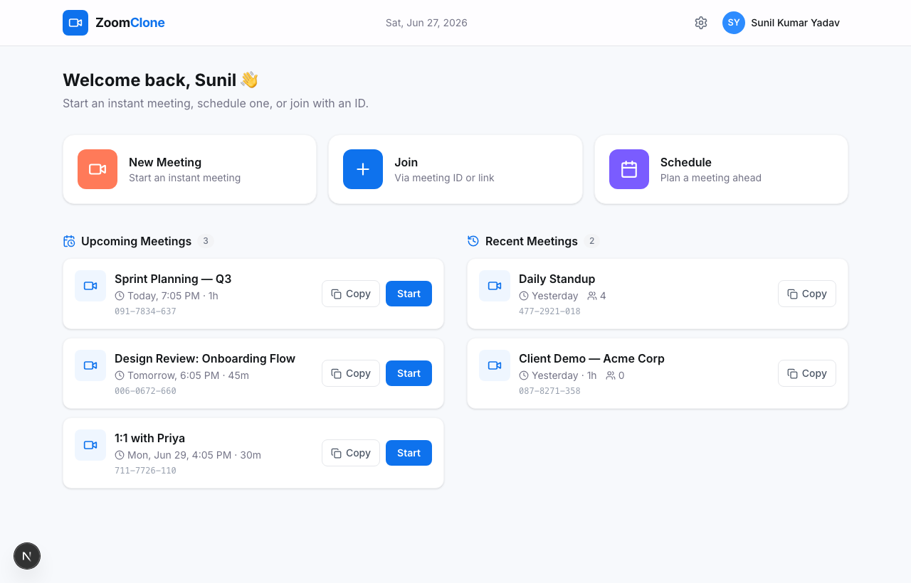
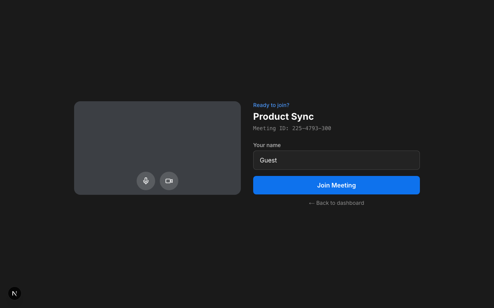
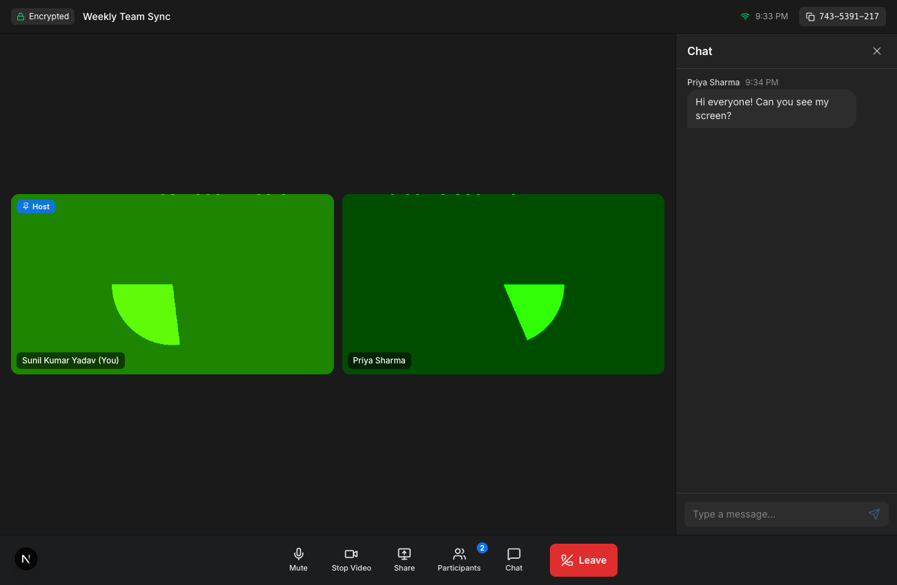

# Video Conferencing Platform (Zoom Clone)

A full-stack video conferencing web app that mirrors Zoom's design and core
meeting workflows: a professional dashboard, instant meetings, scheduling, join
flow, and **real peer-to-peer video/audio over WebRTC** with chat and host
controls.

- **Live demo:** _add your deployed URL here_
- **Repository:** _add your GitHub URL here_

> Built for the SDE Fullstack assignment. Frontend in **Next.js**, backend in
> **Python / FastAPI**, data in **SQLite**.

---

## Screenshots

| Dashboard | Pre-join | Live meeting (2 participants) |
|---|---|---|
|  |  |  |

The app is fully responsive (mobile, tablet, desktop).

---

## Table of Contents

- [Feature checklist](#feature-checklist)
- [Tech stack](#tech-stack)
- [Architecture](#architecture)
- [Database design](#database-design)
- [How the video works (WebRTC)](#how-the-video-works-webrtc)
- [Project structure](#project-structure)
- [Getting started](#getting-started)
- [Environment variables](#environment-variables)
- [API reference](#api-reference)
- [Testing](#testing)
- [Deployment](#deployment)
- [Assumptions](#assumptions)
- [Production notes & limitations](#production-notes--limitations)

---

## Feature checklist

Everything in the brief, mapped to where it lives.

### Core (must have)

- **Landing dashboard** — clean, Zoom-like UI
  - Navbar with profile + settings placeholders — `components/dashboard/Navbar.tsx`
  - New Meeting / Join / Schedule actions — `components/dashboard/ActionTiles.tsx`
  - Upcoming meetings section — `app/page.tsx`
  - Recent meetings section — `app/page.tsx`
- **Instant meeting creation**
  - Creates a meeting instantly — `POST /api/meetings/instant`
  - Unique Meeting ID (Zoom-style `123-4567-890`, CSPRNG) — `backend/app/utils.py`
  - Shareable invite link — generated server-side
  - Redirects into the meeting room — `components/modals/NewMeetingModal.tsx`
- **Join meeting**
  - By Meeting ID **or** pasted invite link — `components/modals/JoinModal.tsx`
  - Display-name gate before joining — `components/meeting/PreJoin.tsx`
  - Validates the meeting exists (404 / 410 handling) — `GET /api/meetings/{code}`
- **Schedule meetings**
  - Title, description, date & time picker, duration — `components/modals/ScheduleModal.tsx`
  - Auto-generates the meeting link, stored in DB — `POST /api/meetings/schedule`
  - Appears in the Upcoming section

### Bonus (good to have)

- **Responsive design** — mobile / tablet / desktop (Tailwind, adaptive grids)
- **Host controls** — mute a participant, remove a participant, **mute all** —
  `components/meeting/ParticipantsPanel.tsx` + signaling
- _User auth is intentionally omitted — the brief says "assume a default user is
  logged in." The schema supports multiple users, so auth can be layered on._

### Extra polish (beyond the brief)

- Real-time **in-meeting chat**, **screen sharing**, camera/mic toggles with live
  state sync, typing-free **gallery view** that adapts to participant count,
  **WebSocket auto-reconnect** with backoff, host auto-promotion when the host
  leaves, error boundaries, and a backend test suite.

---

## Tech stack

| Layer | Choice | Why |
|---|---|---|
| Frontend | **Next.js 16** (App Router, React 19, TypeScript) | Modern SPA, file-based routing, great DX |
| Styling | **Tailwind CSS v4** + lucide-react icons | Fast, consistent, Zoom-like theming |
| Backend | **Python 3.11 / FastAPI** | Async, typed, automatic OpenAPI docs |
| ORM | **SQLAlchemy 2.0** | Typed models, clean relationships |
| Database | **SQLite** | Zero-config, file-based (swap `DATABASE_URL` for Postgres) |
| Realtime | **WebRTC** (mesh) + **WebSocket** signaling | Native browser P2P media; FastAPI relays signaling |
| Tests | **pytest** + Starlette TestClient | Fast API coverage |

---

## Architecture

```
┌──────────────────────────────┐         ┌───────────────────────────────┐
│         Browser (A)          │         │          Browser (B)          │
│  Next.js SPA + useMeeting    │         │   Next.js SPA + useMeeting    │
└──────────────┬───────────────┘         └───────────────┬───────────────┘
               │  REST (fetch)                            │
               │  WebSocket (signaling)                   │
               ▼                                          ▼
        ┌─────────────────────────────────────────────────────┐
        │                  FastAPI backend                    │
        │  /api/meetings  (REST: create/list/join/schedule)   │
        │  /ws/meeting/{code} (WebRTC signaling + chat)       │
        │  SQLAlchemy ──► SQLite (users, meetings, participants)│
        └─────────────────────────────────────────────────────┘

        Media (audio/video) flows DIRECTLY browser ⇄ browser
        over WebRTC — it never passes through the server.
```

The frontend is split into three layers: **components** (UI), the **`useMeeting`
hook** (the realtime engine: media + signaling + peer connections), and a typed
**API/util library**. The backend keeps routers thin and puts all DB logic in a
single `crud.py` layer.

---

## Database design

Three tables with clear relationships (designed, not auto-magic):

```
users                         meetings                         participants
───────────────               ─────────────────────           ──────────────────────
id          PK                id            PK                 id           PK
name                          code          UNIQUE             meeting_id   FK → meetings.id
email       UNIQUE            title                            user_id      FK → users.id (nullable)
avatar_color                  description                      display_name
created_at                    type (instant|scheduled)         role (host|participant)
                              status (scheduled|active|ended)  is_muted
   1                          host_id       FK → users.id      is_video_on
   │ hosts                    scheduled_start                  joined_at
   └───────────────*          duration_minutes                left_at
                              created_at / started_at / ended_at
   1                              1                                ▲
   │ attends                      │ has many                       │
   └──────────────────────────────┴────────────────────────────────┘
```

Relationships:
- **User 1 → \* Meeting** (`host_id`): a user hosts many meetings.
- **Meeting 1 → \* Participant**: a meeting has many participants (cascade delete).
- **User 1 → \* Participant** (nullable): a join record may belong to a registered
  user, or to an anonymous guest (name only).

Design decisions:
- `code` is a unique, URL-safe public identifier so internal `id`s are never
  exposed in links.
- `status` models the meeting lifecycle and powers the Upcoming vs Recent split.
- `participants` captures live media state (`is_muted`, `is_video_on`) and a
  `left_at` timestamp, so attendance and "currently in the room" are both
  derivable.

Schema source: `backend/app/models.py`.

---

## How the video works (WebRTC)

This uses a **mesh** topology: every participant opens a direct
`RTCPeerConnection` to every other participant, so audio/video is true
peer-to-peer and low-latency. The backend is only the **signaling channel**:

1. A browser opens `ws://…/ws/meeting/{code}` and sends `join`.
2. The server replies with the list of peers already present.
3. The newcomer creates an **offer** to each existing peer; existing peers
   **answer** (this ordering avoids "glare"/collisions).
4. ICE candidates are relayed through the same socket until a direct P2P path is
   found (Google STUN; add TURN for restrictive NATs).
5. The same socket also carries chat, mic/cam state, and host controls.

Engine: `frontend/src/lib/useMeeting.ts` · Signaling server:
`backend/app/routers/signaling.py`.

---

## Project structure

```
zoom-clone/
├── backend/
│   ├── app/
│   │   ├── main.py            # FastAPI app, CORS, body-limit, error handler
│   │   ├── config.py          # env-driven settings
│   │   ├── database.py        # engine + session
│   │   ├── models.py          # SQLAlchemy models (schema)
│   │   ├── schemas.py         # Pydantic request/response models
│   │   ├── crud.py            # all DB operations
│   │   ├── utils.py           # meeting-code + invite-link helpers
│   │   ├── seed.py            # sample data
│   │   └── routers/
│   │       ├── meetings.py    # REST endpoints
│   │       └── signaling.py   # WebSocket signaling + chat + host controls
│   ├── tests/                 # pytest API tests
│   ├── requirements.txt
│   ├── requirements-dev.txt
│   └── render.yaml            # one-click Render deploy
└── frontend/
    └── src/
        ├── app/
        │   ├── page.tsx                 # dashboard
        │   ├── meeting/[code]/page.tsx  # meeting (pre-join → room)
        │   ├── error.tsx                # route error boundary
        │   └── layout.tsx, globals.css
        ├── components/{dashboard,modals,meeting,ui}/
        └── lib/                         # api, types, useMeeting, helpers
```

---

## Getting started

**Prerequisites:** Node.js 18+ and Python 3.10+.

### 1. Backend

```bash
cd backend
python3 -m venv .venv
source .venv/bin/activate        # Windows: .venv\Scripts\activate
pip install -r requirements.txt
uvicorn app.main:app --reload --port 8000
```

The API runs at http://localhost:8000 (interactive docs at `/docs`). On first
run it creates the SQLite DB and seeds sample meetings.

### 2. Frontend

```bash
cd frontend
npm install
cp .env.example .env.local        # defaults to http://localhost:8000
npm run dev
```

Open http://localhost:3000.

> **Tip:** to try a real multi-party call locally, open the meeting link in two
> browser windows (or share it to another device on your network) and join with
> different names. Camera/mic permissions are required.

---

## Environment variables

### Backend (`backend/.env`)

| Variable | Default | Purpose |
|---|---|---|
| `DATABASE_URL` | `sqlite:///./zoomclone.db` | DB connection string |
| `FRONTEND_URL` | `http://localhost:3000` | Used to build invite links |
| `CORS_ORIGINS` | `http://localhost:3000,...` | Allowed browser origins |
| `SEED_ON_STARTUP` | `true` | Seed sample data when DB is empty |

### Frontend (`frontend/.env.local`)

| Variable | Default | Purpose |
|---|---|---|
| `NEXT_PUBLIC_API_URL` | `http://localhost:8000` | Backend base URL (REST + WS) |
| `NEXT_PUBLIC_TURN_URL` / `_USERNAME` / `_CREDENTIAL` | – | Optional TURN relay for restrictive NATs |

---

## API reference

| Method | Path | Description |
|---|---|---|
| `GET` | `/api/me` | The default "logged-in" user |
| `GET` | `/api/meetings` | Dashboard data: `{ upcoming, recent }` |
| `POST` | `/api/meetings/instant` | Create an instant meeting |
| `POST` | `/api/meetings/schedule` | Create a scheduled meeting |
| `GET` | `/api/meetings/{code}` | Fetch/validate a meeting |
| `POST` | `/api/meetings/{code}/join` | Register a participant |
| `POST` | `/api/meetings/{code}/end` | End a meeting (host) |
| `WS` | `/ws/meeting/{code}` | WebRTC signaling + chat + host controls |

Full interactive docs (OpenAPI/Swagger) are auto-generated at `/docs`.

---

## Testing

```bash
cd backend
source .venv/bin/activate
pip install -r requirements-dev.txt
pytest -q
```

Covers the full meeting lifecycle: instant/scheduled creation, unique codes,
join + host assignment, validation (404/410/422), end-meeting, and the
request-size guard.

---

## Deployment

The two halves deploy independently.

**Frontend → Vercel**
1. Import the repo; set the **Root Directory** to `frontend`.
2. Add env var `NEXT_PUBLIC_API_URL` = your deployed backend URL.
3. Deploy (Next.js is auto-detected).

**Backend → Render** (a `render.yaml` blueprint is included)
1. New → Blueprint → select this repo (root `backend/`).
2. Set `FRONTEND_URL` and `CORS_ORIGINS` to your Vercel URL.
3. Deploy. Start command: `uvicorn app.main:app --host 0.0.0.0 --port $PORT`.

> Use HTTPS in production so the browser allows camera/mic and `wss://` signaling.

---

## Assumptions

- **No authentication** — per the brief, a single seeded user is treated as
  logged-in. The schema already supports many users.
- **Guests** can join by display name without an account.
- **SQLite** is used as specified; `DATABASE_URL` makes Postgres a drop-in swap.
- **Mesh WebRTC** targets small meetings (the common interview/demo case); see
  limitations below.
- The **first person to join** a room becomes the host; if they leave, host is
  auto-promoted to the next participant.

---

## Production notes & limitations

- **Mesh scaling:** a full mesh is ideal for ~2–6 participants. For large rooms a
  selective forwarding unit (SFU, e.g. mediasoup/LiveKit) would replace the mesh
  — the signaling layer is already structured to make that swap.
- **NAT traversal:** public STUN covers most networks; a **TURN** relay
  (configurable via env) is needed for symmetric/corporate NATs.
- **Signaling state is in-memory** per server instance — fine for one node; use a
  shared pub/sub (e.g. Redis) to scale signaling horizontally.
- **Schema migrations:** tables are created on startup (great for SQLite/dev);
  add Alembic for versioned migrations in production.
